# 30 Days of Google Cloud Leaderboard

Developed with ❤️ by [DSC SIESGST](https://gdsc.community.dev/sies-graduate-school-of-technology-navi-mumbai/)

## Table of Contents
    
- [Introduction](#introduction)
- [Project Setup](#project-setup)
- [Deployment](#deployment)

## Introduction
 
### What is 30 Days of Google Cloud?
30 Days of Google Cloud program provides you an opportunity to kickstart your career in cloud and get hands-on practice on Google Cloud - the tool that powers apps like Google Search, Gmail and YouTube. Along the way you learn & practice concepts like computing, application development, big data & machine learning using cloud & if you get stuck, you will have your "Campus Facilitators" who are specially trained on Google Cloud to help. 😎

### Why should you participate in the program?
- You can showcase what you've learned here to your professional network using Google Cloud-hosted quest & skill badges that you can add to your resume and professional profiles like LinkedIn. 🏆
- And on top of these amazing badges, you get a chance to win some really cool Google Cloud goodies*. 💪

### Program's Syllabus (TRACKS)
The program will introduce you to Computing, Application Development, Big Data & Machine Learning using Google Cloud's training platform called Qwiklabs where you will learn each of these topic using self-paced labs that provides you temporary credentials to Google Cloud, so you can learn the cloud using the real thing – no simulations.

For convenience, Google has divided the topics above into 2 different tracks - Cloud Engineering Track and Data Science & Machine Learning Track.
#### Track 1: Cloud Engineering Track
- Skill Badge: [Getting Started: Create and Manage Cloud Resources](https://google.qwiklabs.com/quests/120)
- Skill Badge: [Perform Foundational Infrastructure Tasks in Google Cloud](https://google.qwiklabs.com/quests/118)
- Skill Badge: [Setup and Configure a Cloud Environment in Google Cloud](https://google.qwiklabs.com/quests/119)
- Skill Badge: [Deploy and Manage Cloud Environments with Google Cloud](https://google.qwiklabs.com/quests/121)
- Skill Badge: [Build and Secure Networks in Google Cloud](https://google.qwiklabs.com/quests/128)
- Skill Badge: [Deploy to Kubernetes in Google Cloud](https://google.qwiklabs.com/quests/116)

### Track 2: Data Science & Machine Learning Track
- Skill Badge: [Getting Started: Create and Manage Cloud Resources](https://google.qwiklabs.com/quests/120)
- Skill Badge: [Perform Foundational Data, ML, and AI Tasks in Google Cloud](https://google.qwiklabs.com/quests/117)
- Skill Badge: [Insights from Data with BigQuery](https://google.qwiklabs.com/quests/123)
- Skill Badge: [Engineer Data in Google Cloud](https://google.qwiklabs.com/quests/132)
- Skill Badge: [Integrate with Machine Learning APIs](https://google.qwiklabs.com/quests/136)
- Skill Badge: [Explore Machine Learning Models with Explainable AI](https://google.qwiklabs.com/quests/126)

See the difference between a quest & a skill badge [here](http://services.google.com/fh/files/emails/diff_quests_skillbadges.png).

## Project Setup
### Creating a Firebase project
- Open the [Firebase Console](https://console.firebase.google.com/).
- Click on the "Create a project" or the "Add Project" button.
<br>
<br>
- Enter a name for your project, accept the [Firebase Terms](https://firebase.google.com/terms) and click on the "Create" button.
<br>
- Enable Google Analytics for your project (Recommended) and click on the "Continue" button.
<br>
- Select the Analytics location, accept the [Google Analytics Terms](https://www.google.com/analytics/terms/us.html) and click on the "Create Project" button.
<br>
-  Wait for the project to be created and then click on the "Continue" button once the project is created.
<br>

### Creating a Firebase Realtime Database
- Click on the "Build" tab in the left side of the screen and then click on "Realtime Database".
<br>
- Click on the "Create Database" button.
<br>
- Select the location of the database and click on the "Next" button.
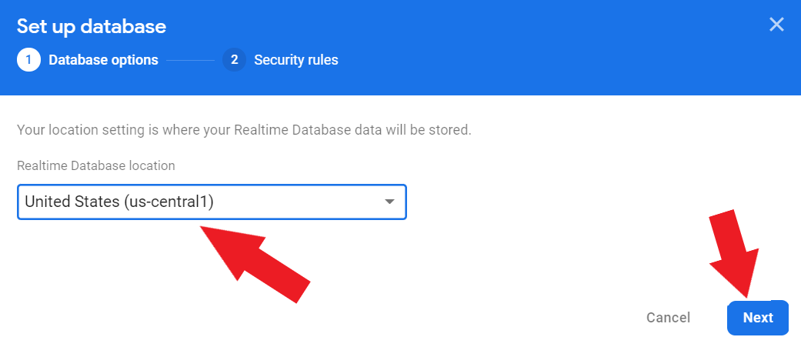<br>
- Choose "Start in test mode" and click on the "Enable" button.
<br>

### Adding "Firebase to our app
- Click on "Project Overview" in the left side of the screen to return to home screen.
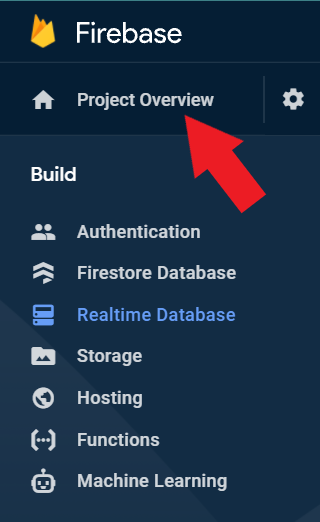<br>
- Click on the "</>" button to create a Web App.
<br>
- Give your app a name and click on the "Register app" button.
<br>
- Note down the configuration details of your app and then click on the "Continue to the console" button.
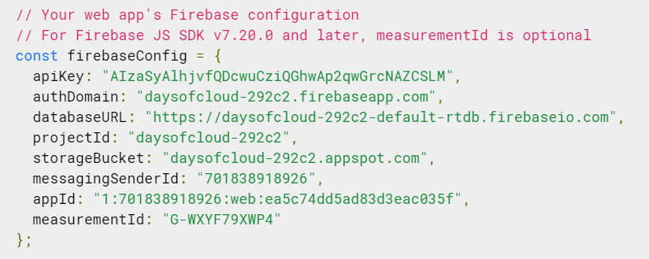<br>
- Click on "Authentication" in the left side of the screen.
<br><br>
- Click on the "Get Started" button.
<br>
- Click on the "Email/Password" button.
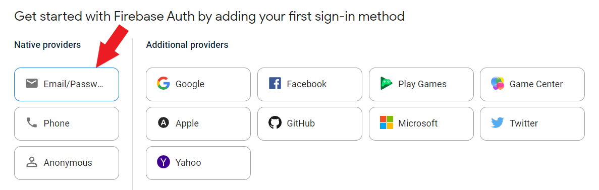<br>
- Toggle the "Enable" button for Email/Password and click on the "Save" button.
<br>


### Download and setup the source code for deployment
#### Clone this repository
- Command to clone:&nbsp;&nbsp;```git clone https://github.com/DSC-SIES-GST/30-Days-of-Google-Cloud-Leaderboard.git```
#### Remove unwanted files and folders
- Delete the following files/folders from the repository:
    - README.md
    - screenshots/
#### Setup the project with the following steps:
- Change the content in ```leaderboard.csv``` to your own data having the following columns with the exact column names as shown below (Preferably don't change the first line in ```leaderboard.csv``` as it contains the column names):
    - Student Name
    - Total
- Open ```flask_app.py``` and change the following lines:
    - <b>Line 11</b>: Create a secret key for the application
    - <b>Line 14 to 23</b>: Add firebase credentials generated from the Firebase console previously

### Password generation
- Open https://www.random.org/strings/ and select the following options:
    - Number of Random strings
    - Length of each string
    - Type of characters to use
    - Each string should be unique (like raffle tickets)
- Click on the "Get Strings" button and copy the generated strings.
<br>
<br>
- Open an excel sheet and paste the generated strings in the following columns:
    - Student Email ID (To be taken from the data you have)
    - Password
- Save the excel sheet as ```student_authentication.csv```
- Sample output of the csv file:
<br><br>
- Open ```addUsers.py``` and add firebase credentials generated from the Firebase console previously on <b>Line 5 to 14</b>
- Ensure that you have installed [Python](https://www.python.org/downloads/) on your machine.
- Run the following commands in the command prompt in the same directory as this cloned repository, to install the required libraries:
    - ```py -m venv env```
    - ```source env/bin/activate``` (for ubuntu) or ```"env/Scripts/activate"``` (for windows) 
    - ```pip install pyrebase4```
    - ```pip install pandas```
- Run the script using the following command: ```py addUsers.py```. <span style="color: red;">(It is recommended to run the script for a maximum of 10 student configurations at a time to avoid the time limit of the script. To achieve this, keep only 10 student configurations in the csv file and run the script for each of them.)</style>
- The script will add the users to the database.
- Sample output of the script:
<br>
- Firebase will automatically create a user with the email ID and password you have provided. Go to Users tab in the Firebase console and check the created users.
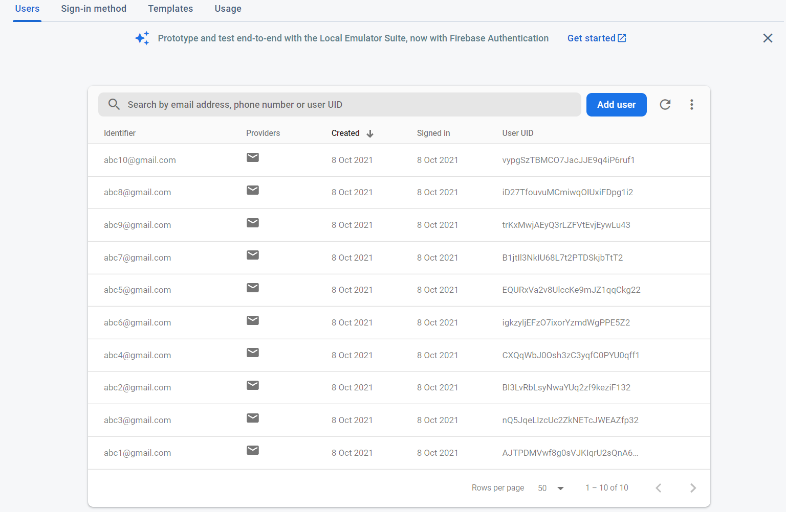<br>
- Once all the users are added, we are now ready to deploy the app to the Pythonanywhere server.

## Deployment
### Repository Setup
- Delete the following unnecessary files and folders from the repository:
    - addUsers.py
    - env/
    - student_authentication.csv
- Push this entire folder to a Public GitHub repository.

### Pythonanywhere account setup
- Go to https://www.pythonanywhere.com/ and login/signup with your email ID and password.
- Follow the below images for the deployment steps.
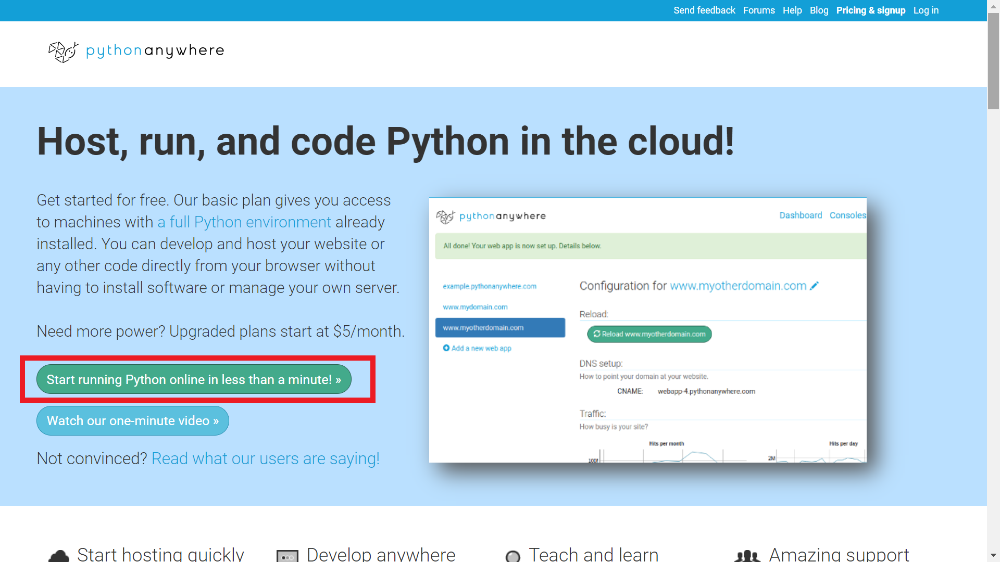<br>
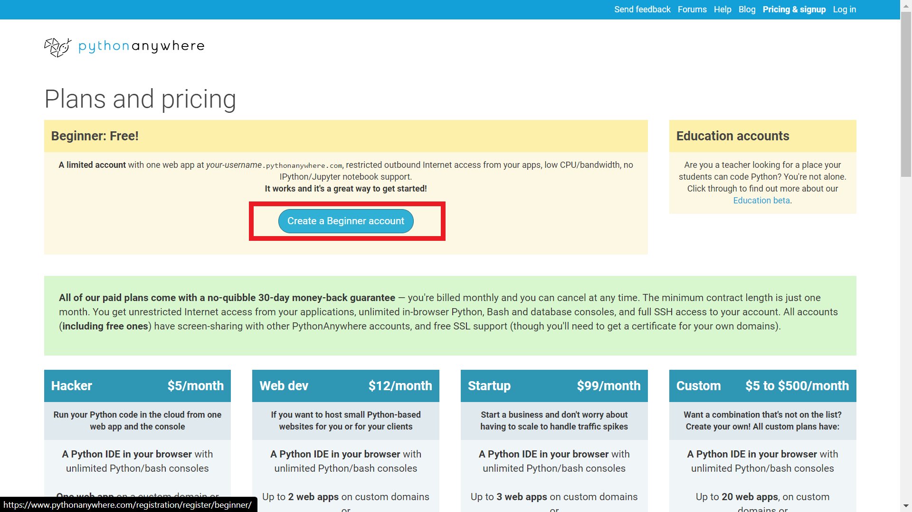<br>
- Fill all details for registration.
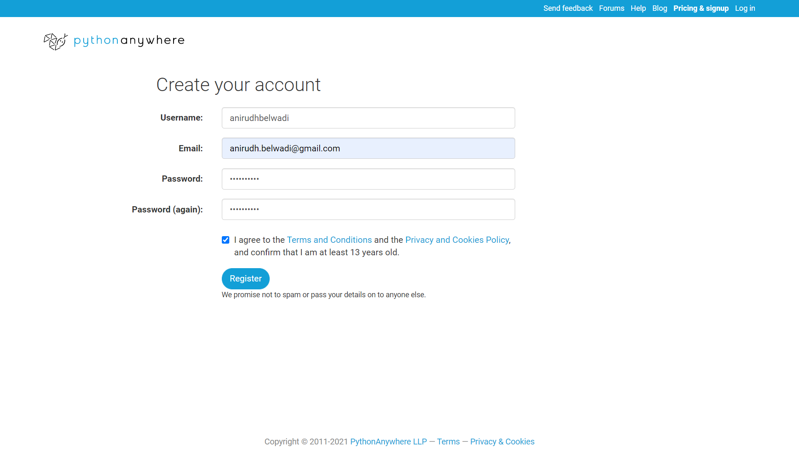<br>
- Verify the email ID from the provided email ID's inbox.

### Creating a web application in Python Anywhere
- Dashboard will open after registration. Click on Web to view web apps page.
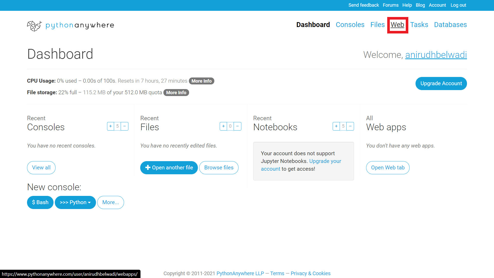<br>
- Create a new web app.
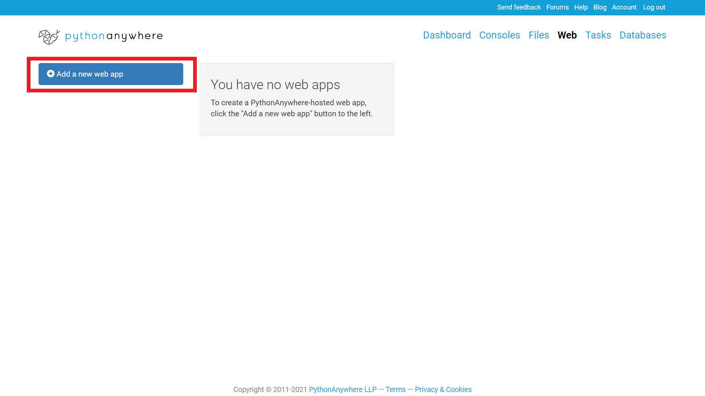

- Select Flask Framework.
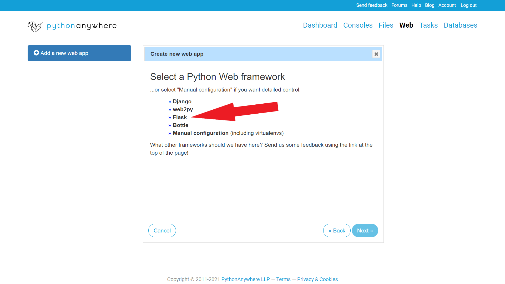
- Select Python Version
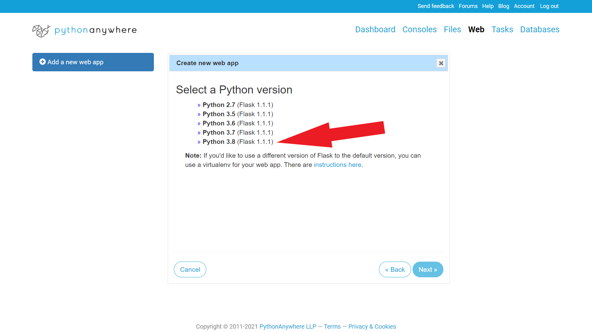
- Enter path for flask file (Kept default here).
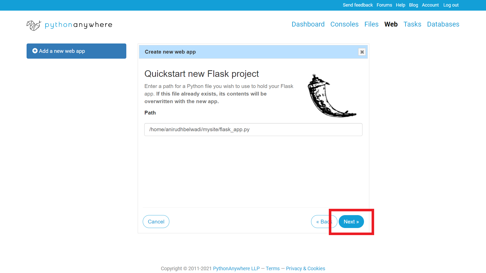
- Check the default Flask application live on the link provided (<your_username>.pythonanywhere.com).
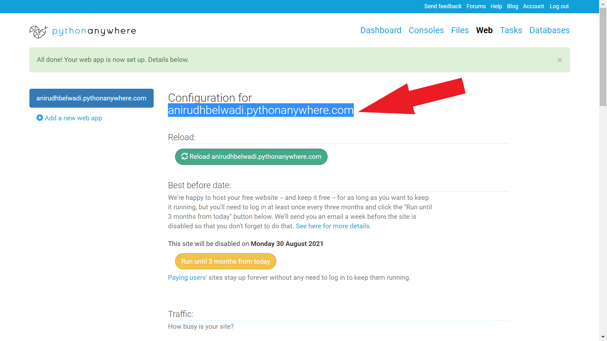


### Uploading custom files for deployment
- Click on the "Consoles" button on the top navigation bar.
<br>
- In Start a new Console, click on the "Bash" button.
<br>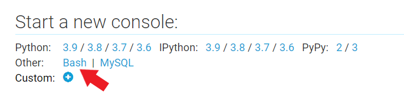<br>
- Run the following command to clone the previously created GitHub repository
    - ```git clone ```
- Run the following commands to install the required libraries:
    - ```pip install pyrebase4```
    - ```pip install pandas```
- Run the following command to move all the files from the cloned repository folder to the web app (mysite) folder:
    - ```mv 30-Days-of-Google-Cloud-Leaderboard/* mysite/```
- Go back the Web app page and click on the "Reload" button in green box.
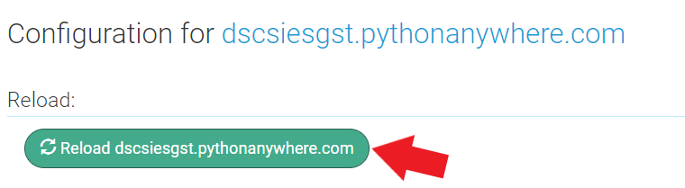<br>
- Verify the live web app on the link provided (<your_username>.pythonanywhere.com).
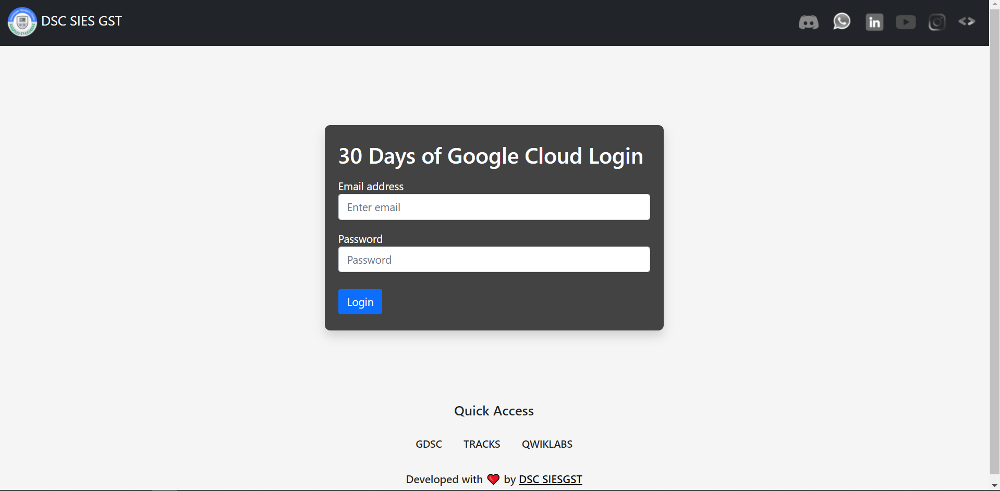<br>
- Enter any one of the registered email ID's and password from the csv file and click on the "Login" button.
- You will be redirected to the leaderboard page.
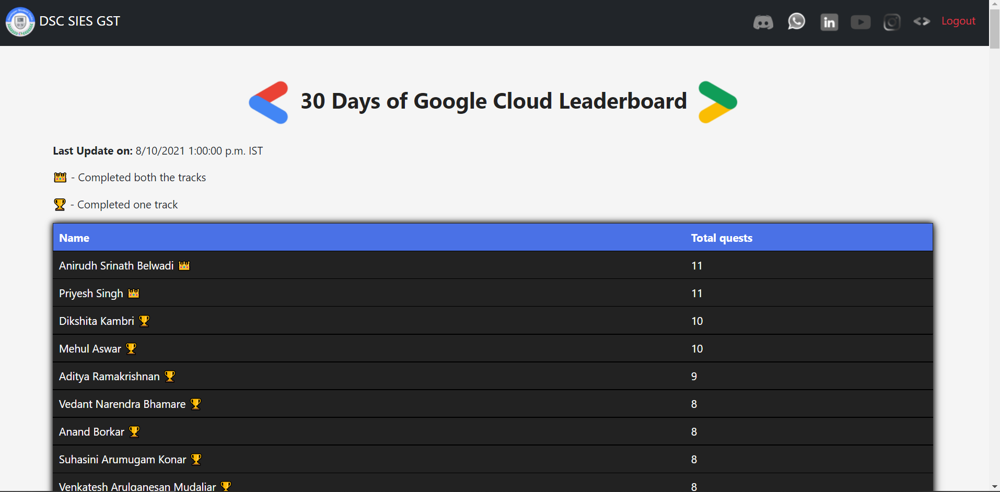<br>
- Click on the "Logout" button to logout.


### Your leaderboard is ready! Share it with your participants along with the instructions including the email ID and password to get the leaderboard.

## Maintenence
### Adding new student authentication
- Open Authentication from the left navigation bar.<br>
<br>
- Click on "Add User" button.
<br>
- Enter the email ID and password for the new user(s)
<br>
- Verify that the user(s) is/are added to the table.
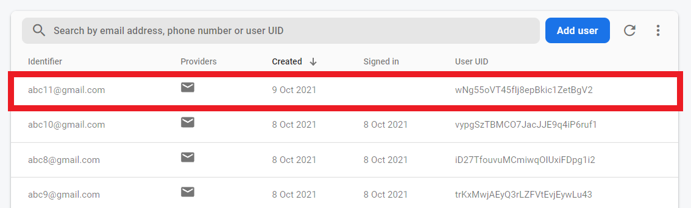<br>

### Updating the leaderboard
- Open the leaderboard csv file received from DSC and just keep the following columns:
    - Student Name
    - \# of Skill Badges Completed in Track 1
    - \# of Skill Badges Completed in Track 2
<br><br>
- Create a new column having the title "```Total```" and add the sum of the previous two columns: (```# of Skill Badges Completed in Track 1 + # of Skill Badges Completed in Track 2```)
<br>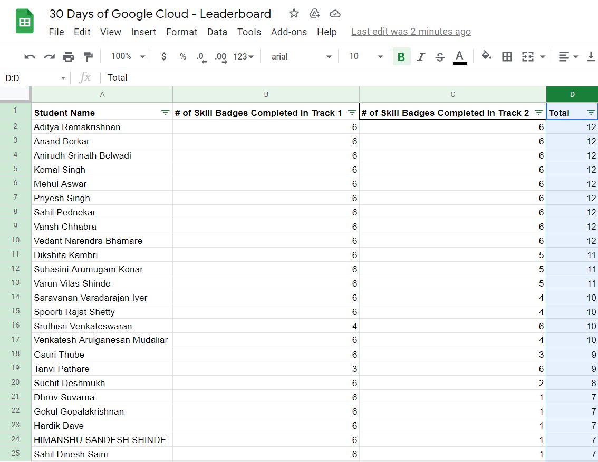<br>
- Save the sheet as a csv file.
<br><br>
- The name of the file should be changed to "```leaderboard.csv```"
<br>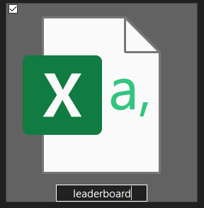<br>
- Open the leaderboard csv file in notepad.
<br><br>
- Open ```leaderboard.csv``` in the pythonanywhere server from Files tab at location ```/home/<your_username>/mysite/leaderboard.csv``` and paste the contents of the ```leaderboard.csv``` file opened in notepad. CLick on the "Save" button.
<br><br>
- Go back the Web app page and click on the "Reload" button in green box.
<br><br>
- Verify the live updated web app on the link provided (<your_username>.pythonanywhere.com).